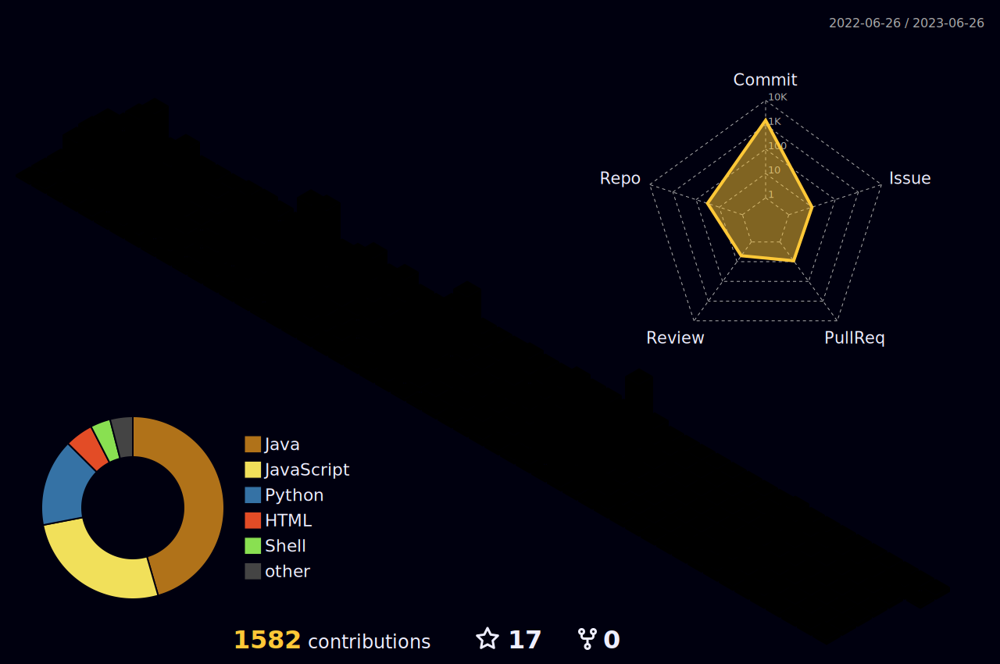

<!--  -->

<h3 align="center">
💻 Developers who want to grow steadily 💻

 

  

<h4 align="center">

:cloud: SNS :cloud:  
  
<!--  -->

***

🛠 Stack 🛠

<!-- 뱃지 링크 : https://github.com/Ileriayo/markdown-badges?tab=readme-ov-file -->

<!-- 

-->

 
    
<h4 align="center">
  
<!--
🍏 Features 🍏

 
-->

